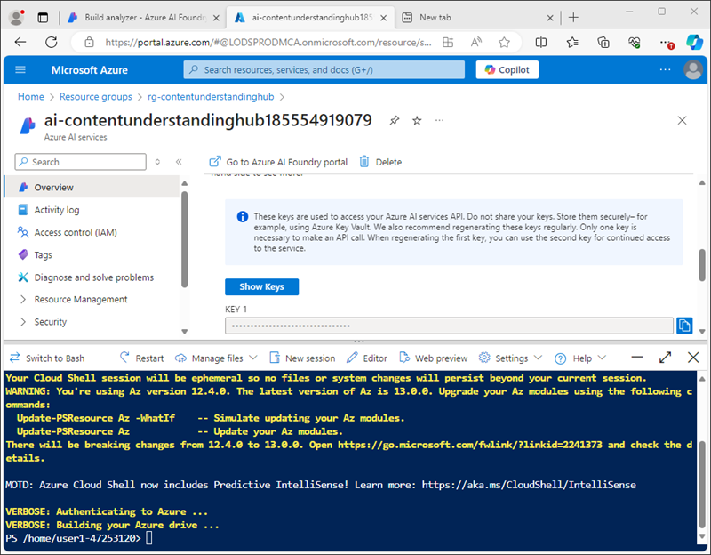

---
lab:
  title: Azure AI コンテンツ解釈を使用してコンテンツを分析する
  module: Multimodal analysis with Content Understanding
---

# Azure AI コンテンツ解釈を使用してコンテンツを分析する

この演習では、Azure AI Foundry ポータルを使用して、旅行保険契約フォームから情報を抽出できるコンテンツ解釈プロジェクトを作成します。 そして、Azure AI Foundry ポータルでコンテンツ アナライザーをテストし、コンテンツ解釈 REST インターフェイスを使用して実行します。

この演習は約 **30** 分かかります。

## コンテンツ解釈プロジェクトを作成する

まず、Azure AI Foundry ポータルを使用してコンテンツ解釈プロジェクトを作成しましょう。

1. Web ブラウザーで [Azure AI Foundry ポータル](https://ai.azure.com) (`https://ai.azure.com`) を開き、Azure 資格情報を使用してサインインします。

    Azure AI Foundry ポータルのホーム ページは次の画像のようになります。

    

1. ホーム ページの **[Find it fast]** セクションで、下の方にある **[コンテンツ解釈]** を選択します。
1. **[コンテンツ解釈]** ページで、**[新しいコンテンツ解釈プロジェクトの作成]** ボタンを選択します。
1. **[プロジェクトの概要]** ステップで、プロジェクトについての次のプロパティを設定し、**[次へ]** を選択します。
    - **プロジェクト名**: `travel-insurance`
    - **説明**: `Insurance policy data extraction`
    - **ハブ**: 新しいハブを作成する
1. **[ハブの作成]** ステップで、次のプロパティを設定し、**[次へ]** を選択します。
    - **Azure AI ハブ リソース**: `content-understanding-hub`
    - **Azure サブスクリプション**: "使用する Azure サブスクリプションを選択します"**
    - **リソース グループ**: *適切な名前で新しいリソース グループを作成します*
    - **[場所]**: 任意の使用可能な場所を選択します**
    - **Azure AI サービス**: *適切な名前で新しい Azure AI サービス リソースを作成します*
1. **[ストレージの設定]** ステップで、新しい AI Hub ストレージ アカウントを指定し、**[次へ]** を選択します。
1. **[レビュー]** ページで、**[プロジェクトの作成]** を選択します。 そして、プロジェクトとその関連リソースが作成されるまで待ちます。

    プロジェクトの準備ができたら、それを **[スキーマの定義]** ページで開きます。

    

## Azure リソースのレビュー

AI Hub とプロジェクトを作成したときに、プロジェクトをサポートするさまざまなリソースが Azure サブスクリプションに作成されました。

1. 新しいブラウザー タブで [Azure portal](https://portal.azure.com) (`https://portal.azure.com`) を開き、Azure 資格情報を使用してサインインします。
1. ハブ用に作成したリソース グループに移動し、作成された Azure リソースを確認します。

    

## カスタム スキーマを定義する

旅行保険フォームから情報を抽出できるアナライザーを構築しようとしています。 まず、サンプル フォームに基づいてスキーマを定義します。

1. `https://github.com/microsoftlearning/mslearn-ai-document-intelligence/raw/main/Labfiles/05-content-understanding/forms/train-form.pdf` から [train-form.pdf](https://github.com/microsoftlearning/mslearn-ai-document-intelligence/raw/main/Labfiles/05-content-understanding/forms/train-form.pdf) サンプル フォームをダウンロードし、ローカル フォルダーに保存します。
1. コンテンツ解釈プロジェクトが含まれているブラウザー タブに戻り、**[スキーマの定義]** ページで、先ほどダウンロードした **train-form.pdf** ファイルをアップロードします。
1. **[ドキュメント分析]** テンプレートを選択し、**[作成]** を選択します。

    スキーマ エディターでは、フォームから抽出するデータ フィールドを定義でき、このフィールドは右側に表示されます。 このフォームは次のようになります。

    

    フォームのデータ フィールドは次で構成されます。
    
    - 保険契約者に関する個人情報のコレクション。
    - 保険が必要な旅行に関連する詳細のコレクション。
    - 署名と日付

    まず、個人の詳細を表すフィールドをテーブルとして追加します。このフィールドで個々の詳細のサブフィールドを定義します。

1. **[+ 新しいフィールドの追加]** を選択して、次の値が入った新しいフィールドを作成します。
    - **フィールド名**: `PersonalDetails`
    - **フィールドの説明**: `Policyholder information`
    - **値の型**: テーブル
1. **[変更の保存]** (&#10004;) を選択し、新しいサブフィールドが自動的に作成されたことを確認します。
1. 次の値を使用して新しいサブフィールドを構成します。
    - **フィールド名**: `PolicyholderName`
    - **フィールドの説明**: `Policyholder name`
    - **値の型**: 文字列
    - **方法**: 抽出
1. **[+ 新しいサブフィールドの追加]** ボタンを使用して、次のサブフィールドを追加します。

    | フィールド名 | フィールド説明 | 値の型 | メソッド |
    |--|--|--|--|
    | `StreetAddress` | `Policyholder address` | String | Extract |
    | `City` | `Policyholder city` | String | Extract |
    | `PostalCode` | `Policyholder post code` | String | Extract |
    | `CountryRegion` | `Policyholder country or region` | String | Extract |
    | `DateOfBirth` | `Policyholder birth date` | 日付 | Extract |

1. すべての個人詳細サブフィールドを追加したら、**[戻る]** ボタンを使用してスキーマの最上位レベルに戻ります。
1. 保険対象の旅行の詳細を表す、**`TripDetails`** という名前の新しい*テーブル*フィールドを追加します。 そして、そこに次のサブフィールドを追加します。

    | フィールド名 | フィールド説明 | 値の型 | メソッド |
    |--|--|--|--|
    | `DestinationCity` | `Trip city` | String | Extract |
    | `DestinationCountry` | `Trip country or region` | String | Extract |
    | `DepartureDate` | `Date of departure` | 日付 | Extract |
    | `ReturnDate` | `Date of return` | 日付 | Extract |

1. スキーマの最上位レベルに戻り、次の 2 つの個人フィールドを追加します。

    | フィールド名 | フィールド説明 | 値の型 | メソッド |
    |--|--|--|--|
    | `Signature` | `Policyholder signature` | String | Extract |
    | `Date` | `Date of signature` | 日付 | Extract |

1. 完成したスキーマが次のようになっていることを確認し、保存します。

    

1. **[アナライザーのテスト]** ページで、分析が自動的に開始されない場合は、**[分析の実行]** を選択します。 そして、分析が完了するのを待ち、スキーマ内のフィールドと一致すると特定されたフォームのテキスト値を確認します。

    

    コンテンツ解釈サービスは、スキーマ内のフィールドに対応するテキストを正しく識別している必要があります。 そうなっていない場合は、**[ラベル データ]** ページを使用して別のサンプル フォームをアップロードし、各フィールドの正しいテキストを明示的に識別することができます。

## アナライザーをビルドしてテストする

保険フォームからフィールドを抽出するモデルをトレーニングしたので、同様のフォームで使用するアナライザーをビルドできます。

1. 左側ナビゲーション ウィンドウで、**[アナライザーのビルド]** ページを選択します。
1. **[+ アナライザーのビルド]** を選択し、次のプロパティ (次に示すとおりに正確に入力) を使用して新しいアナライザーをビルドします。
    - **名前**: `travel-insurance-analyzer`
    - **説明**: `Insurance form analyzer`
1. 新しいアナライザーの準備が整うのを待ちます (**[最新の情報に更新]** ボタンで確認できます)。
1. `https://github.com/microsoftlearning/mslearn-ai-document-intelligence/raw/main/Labfiles/05-content-understanding/forms/test-form.pdf` から [test-form.pdf](https://github.com/microsoftlearning/mslearn-ai-document-intelligence/raw/main/Labfiles/05-content-understanding/forms/test-form.pdf) をダウンロードし、ローカル フォルダーに保存します。
1. **[アナライザーのビルド]** ページに戻り、**travel-insurance-analyzer** リンクを選択します。 アナライザーのスキーマで定義されているフィールドが表示されます。
1. **[travel-insurance-analyzer]** ページで、**[テスト]** を選択します。
1. **[+ テスト ファイルのアップロード]** ボタンを使用して **test-form.pdf** をアップロードし、分析を実行してテスト フォームからフィールド データを抽出します。

    

1. **[結果]** タブを表示して、アナライザーによって返された JSON 形式の結果を表示します。 次のタスクでは、コンテンツ解釈 REST API を使用してフォームをアナライザーに送信し、結果をこの形式で返します。
1. **[travel-insurance-analyzer]** ページを閉じます。

## コンテンツ解釈 REST API を使用する

アナライザーを作成したので、コンテンツ解釈 REST API を使用してクライアント アプリケーションからアナライザーを実行できます。

1. Azure portal を含むブラウザー タブに切り替えます (または、閉じた場合は新しいタブで `https://portal.azure.com` を開きます)。
1. コンテンツ解釈ハブのリソース グループで、**"Azure AI サービス"** リソースを開きます。
1. **[概要]** ページの **[キーとエンドポイント]** セクションで、**[コンテンツ解釈]** タブを表示します。

    

    クライアント アプリケーションからアナライザーに接続するには、コンテンツ解釈エンドポイントといずれかのキーが必要です。

1. ページ上部の検索バーの右側にある **[\>_]** ボタンを使用して、Azure portal に新しい Cloud Shell を作成します。***PowerShell*** 環境を選択します。 次に示すように、Azure portal の下部にあるペインに、Cloud Shell のコマンド ライン インターフェイスが表示されます。

    

    > **注**: *Bash* 環境を使用するクラウド シェルを以前に作成した場合は、それを ***PowerShell*** に切り替えます。

1. ペインの上部にある区分線をドラッグして Cloud Shell のサイズを変更したり、ペインの右上にある **&#8212;** 、 **&#10530;** 、**X** アイコンを使用して、ペインを最小化または最大化したり、閉じたりすることができます。 Azure Cloud Shell の使い方について詳しくは、[Azure Cloud Shell のドキュメント](https://docs.microsoft.com/azure/cloud-shell/overview)をご覧ください。
1. Cloud Shell ツール バーの **[設定]** メニューで、**[クラシック バージョンに移動]** を選択します (これはコード エディターを使用するのに必要です)。

1. PowerShell ペインで、次のコマンドを入力して、この演習用の GitHub リポジトリを複製します。

    ```
    rm -r mslearn-ai-doc -f
    git clone https://github.com/microsoftlearning/mslearn-ai-document-intelligence mslearn-ai-doc
    ```

1. リポジトリが複製されたら、**mslearn-ai-doc/Labfiles/05-content-understanding/code** フォルダーに移動します。

    ```
    cd mslearn-ai-doc/Labfiles/05-content-understanding/code
    ```

1. 次のコマンドを入力して、提供されている **analyze_doc.py** Python コード ファイルを編集します。

    ```
    code analyze_doc.py
    ```
    Python コード ファイルはコード エディターで開かれます。

    

1. コード ファイルで、**\<CONTENT_UNDERSTANDING_ENDPOINT\>** プレースホルダーを使用するコンテンツ解釈エンドポイントに置き換え、**\<CONTENT_UNDERSTANDING_KEY\>** プレースホルダーを Azure AI サービス リソースのキーのいずれかに置き換えます。

    > **ヒント**: Azure portal の Azure AI サービス リソース ページからエンドポイントとキーをコピーするには、Cloud Shell ウィンドウのサイズを変更または最小化する必要があります。Cloud Shell を*閉じない*ように注意してください (閉じてしまうと、上記の手順を繰り返す必要があります)。

1. プレースホルダーを置き換えたら、**Ctrl + S** コマンドを使用して変更を保存し、完成したコードを確認します。このコードの動作は次のとおりです。
    - コンテンツ解釈エンドポイントに HTTP POST 要求を送信し、**travel-insurance-analyzer** にその URL に基づいてフォームを分析するように指示します。
    - POST 操作からの応答をチェックして、分析操作の ID を取得します。
    - 操作が実行されなくなるまで、HTTP GET 要求をコンテンツ解釈サービスに繰り返し送信します。
    - 操作が成功した場合は、JSON 応答を表示します。
1. **Ctrl + Q** コマンドを使用して、Cloud Shell コマンド ラインを開いたままコード エディターを閉じます。
1. Cloud Shell コマンド ライン ペインで、次のコマンドを入力して Python **requests** ライブラリ (コードで使用されます) をインストールします。

    ```
    pip install requests
    ```

1. ライブラリがインストールされたら、Cloud Shell コマンド ライン ペインで、次のコマンドを入力して Python コードを実行します。

    ```
    python analyze_doc.py
    ```

1. プログラムからの出力を確認します。これには、ドキュメント分析の JSON 結果が含まれます。

    > **ヒント**: Cloud Shell コンソールのスクリーン バッファーは、出力全体を表示するのに十分な大きさではない場合があります。 出力全体を確認する場合は、コマンド `python analyze_doc.py > output.txt` を使用してプログラムを実行します。 そして、プログラムが完了したら、コマンド `code output.txt` を使用して、コード エディターで出力を開きます。

## クリーンアップ

コンテンツ解釈サービスの操作が終わったら、不要な Azure コストが発生しないように、この演習で作成したリソースを削除する必要があります。

1. Azure AI Foundry ポータルで、**travel-insurance** プロジェクトに移動して削除します。
1. Azure portal において、この演習で作成したリソース グループを削除します。

